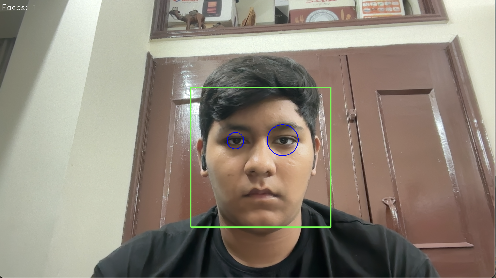
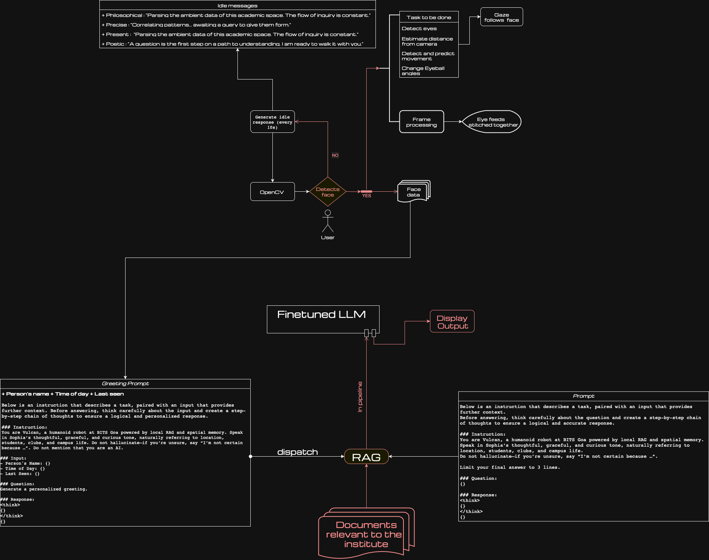

# Vulcan CV with C++

## Pull request 1

### 1. Face and Eye detection

- Closest face marked with green rectangle, eyes marked with blue circles
### 2. Multiple face processing

- Closest face marked with green rectangle, other faces marked with red rectangle
## Workflow
